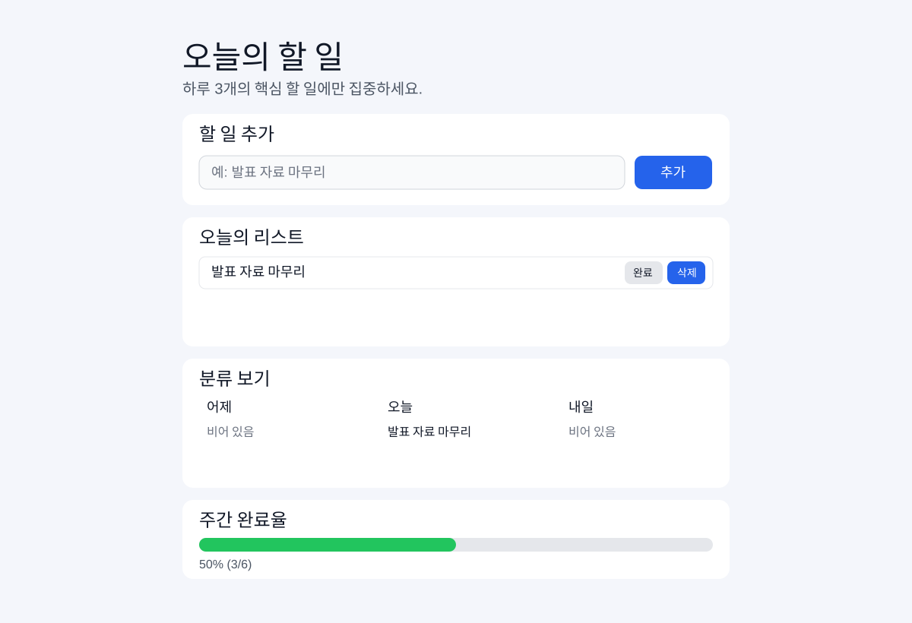

# 오늘의 할 일 (MVP)

PRD 기반으로 구현한 **하루 3개 제한 미니멀 투두 앱**입니다.

## 미리보기
아래 이미지는 실제 UI 구조를 그대로 반영한 시각 미리보기입니다.



## 실행 방법
```bash
python3 -m http.server 4173
```
브라우저에서 `http://localhost:4173` 접속.

## 핵심 기능
- 할 일 추가 / 완료 / 삭제
- 하루 3개 제한
- 어제 / 오늘 / 내일 자동 분류
- 주간 완료율 진행률 바
